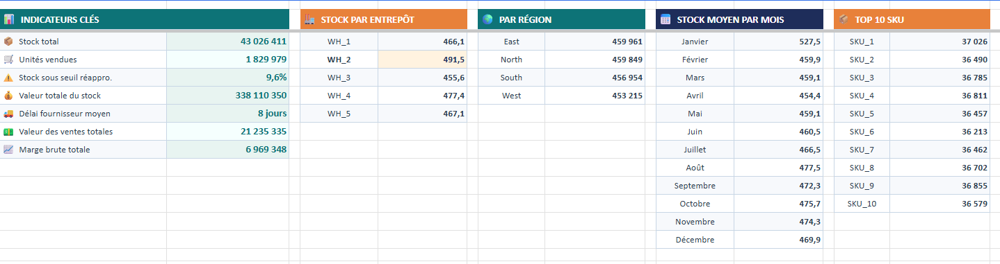
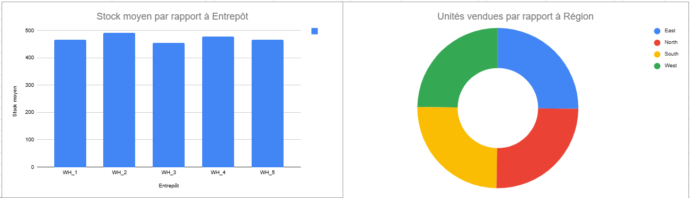
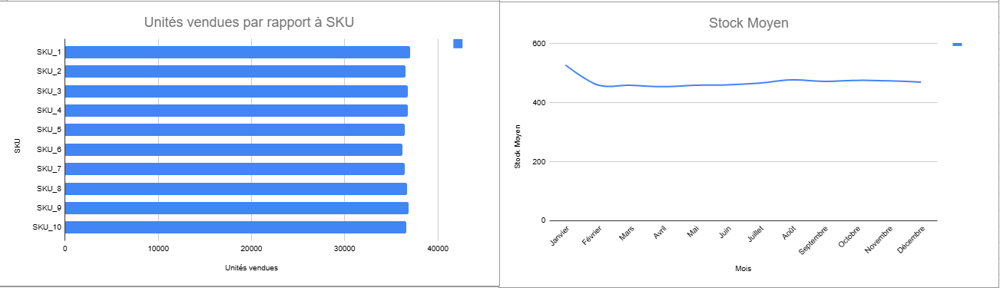
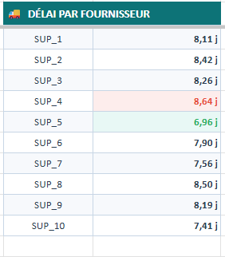
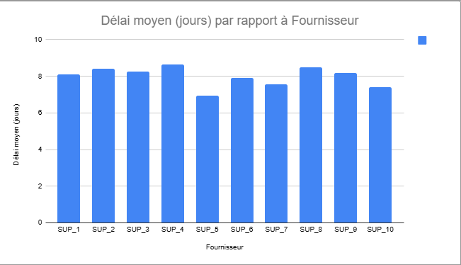
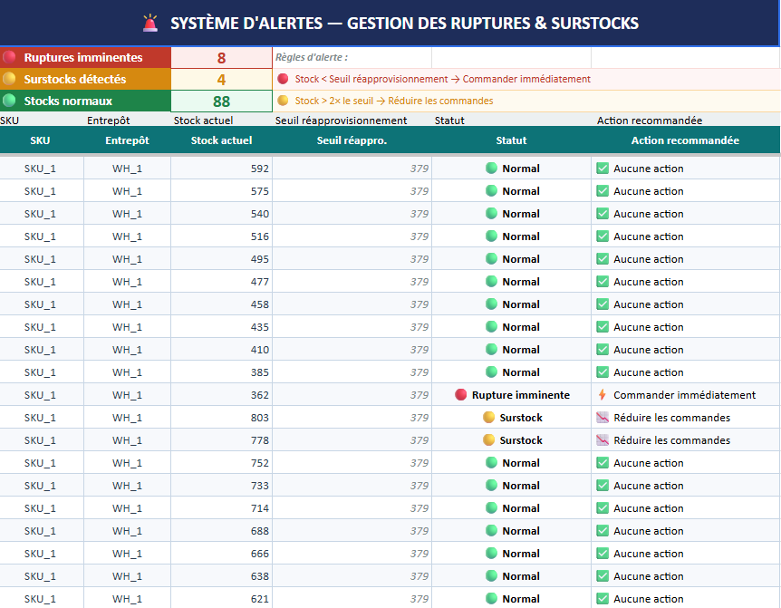

# 📦 Suivi des Stocks Supply Chain — Google Sheets Dashboard

> Projet portfolio Data Analyst · Secteur Logistique & Retail · 2024









---

## 🎯 Problématique

**Comment détecter automatiquement les risques de rupture et de surstock sur un entrepôt multi-sites, et identifier les fournisseurs les moins performants ?**

---

## 📊 KPIs Clés

| KPI | Valeur |
|-----|--------|
| 📦 Stock total | 43 026 411 unités |
| 🛒 Unités vendues | 1 829 979 |
| ⚠️ Stock sous seuil réappro. | 9.6% |
| 💰 Valeur totale du stock | 338 110 350 € |
| 🚚 Délai fournisseur moyen | 8 jours |
| 💵 Valeur des ventes | 21 235 335 € |
| 📈 Marge brute totale | 6 969 348 € |

---

## 💡 Insights Clés

- **WH_2 stocke le plus** (491.5 unités en moyenne) vs WH_3 le moins chargé (455.6) → risque d'immobilisation de capital à WH_2
- **SUP_4 = fournisseur le plus lent** (8.64j) vs SUP_5 le plus rapide (6.96j) → 1.68j d'écart, levier de négociation direct
- **9.6% des lignes sous seuil** → 8 ruptures imminentes détectées sur 100 lignes analysées
- **Stock au plus haut en Janvier** (527.5) → saisonnalité post-fêtes à anticiper pour les commandes
- **4 régions équilibrées** (~25% chacune) → pas de dépendance géographique

---

## 🚨 Système d'Alertes Automatiques

3 niveaux de détection basés sur le seuil de réapprovisionnement :

| Statut | Condition | Action |
|--------|-----------|--------|
| 🔴 Rupture imminente | Stock < Seuil réappro. | Commander immédiatement |
| 🟡 Surstock | Stock > 2× le seuil | Réduire les commandes |
| 🟢 Normal | Entre les deux seuils | Aucune action requise |

**Résultats sur 100 lignes :** 8 ruptures · 4 surstocks · 86 normaux

---

## 📊 Structure du Dashboard

**3 onglets Google Sheets :**

| Onglet | Contenu |
|--------|---------|
| **Données** | Dataset brut — 91 250 lignes × 15 colonnes |
| **Dashboard** | 7 KPIs + 5 graphiques interactifs |
| **Alertes** | Détection automatique ruptures & surstocks |

---

## 📐 Formules Google Sheets Avancées

```
-- Valeur totale du stock (colonnes texte → conversion)
=SUMPRODUCT(SUBSTITUE(Données!G2:G91251;".";",")*1*SUBSTITUE(Données!K2:K91251;".";",")*1)

-- Taux stock sous seuil réapprovisionnement
=ROUND(COUNTIF(Données!G2:G91251;"<"&AVERAGE(Données!I2:I91251))/COUNTA(Données!G2:G91251)*100;1)&"%"

-- Stock moyen mensuel (AVERAGEIFS avec dates)
=AVERAGEIFS(Données!G$2:G$91251;Données!A$2:A$91251;">="&DATE(2024;1;1);Données!A$2:A$91251;"<"&DATE(2024;2;1))

-- Système d'alertes (SI imbriqué)
=SI(C2<D2;"🔴 Rupture imminente";SI(C2>D2*2;"🟡 Surstock";"🟢 Normal"))
```

---

## 🗄️ Dataset

**Source :** [Kaggle — High-Dimensional Supply Chain Inventory Dataset](https://www.kaggle.com/datasets/ziya07/high-dimensional-supply-chain-inventory-dataset)

**91 250 lignes × 15 colonnes** — SKU, entrepôts, fournisseurs, stocks, ventes, prévisions

---

## 🛠️ Stack technique

- **Google Sheets** — Dashboard interactif et alertes automatiques
- **Formules avancées** — AVERAGEIFS, SUMPRODUCT, COUNTIF, SI imbriqués
- **Kaggle** — Source de données publique réelle
- **GitHub** — Versioning et présentation portfolio

---

## 🚀 Reproduire le projet

1. Télécharger le dataset sur [Kaggle](https://www.kaggle.com/datasets/ziya07/high-dimensional-supply-chain-inventory-dataset)
2. Créer un Google Sheets avec 3 onglets : `Données`, `Dashboard`, `Alertes`
3. Importer le CSV via **Fichier → Importer**
4. Reproduire les formules décrites dans ce README

---

## 👤 Auteur

**Thierry Laguerre** · Candidat Data Analyst Junior · Paris Île-de-France

Master Big Data — Paris 8 · Licence Informatique — Sorbonne Paris Nord

[](https://www.linkedin.com/in/thierry-laguerre-ba1267257/)
[](https://github.com/thierrylaguerre)
[](mailto:thierrylaguerre81@gmail.com)
